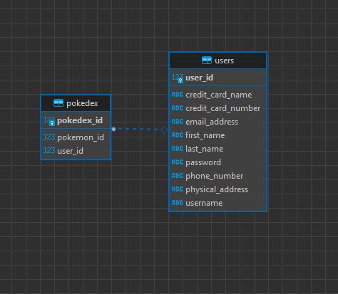

# Pokemon Black Market

## Executive Summary
The Pokemon Black Market is an e-commerce service which allows users to register. Once registered, users are able to browse the site and choose pokemon they would like to purchase. Those selected pokemon are put into a cart, which is able to be moved to checkout for a final payment. Items can be added or removed from the cart, in varying quantities. The product information for the store page is pulled directly form the PokeAPI. Users are able to create a profile in which their information is saved. Users are also able to edit their profile information.   

## Physical Model

## Technologies Used

